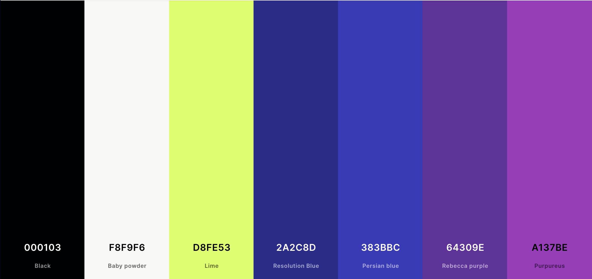
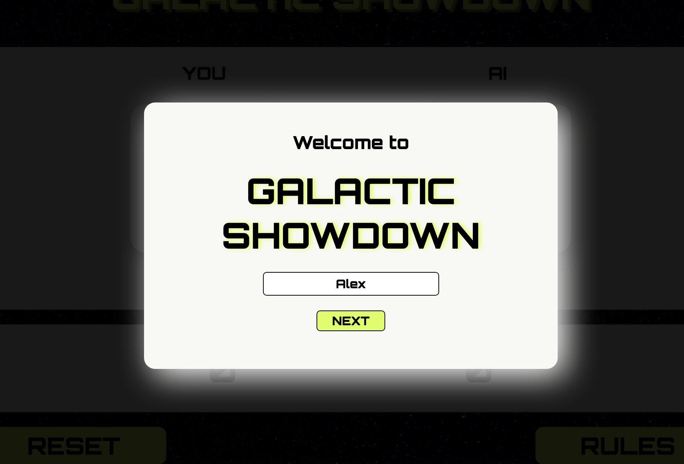
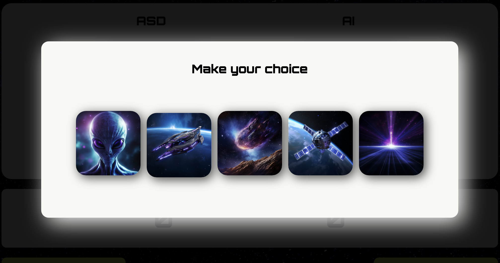
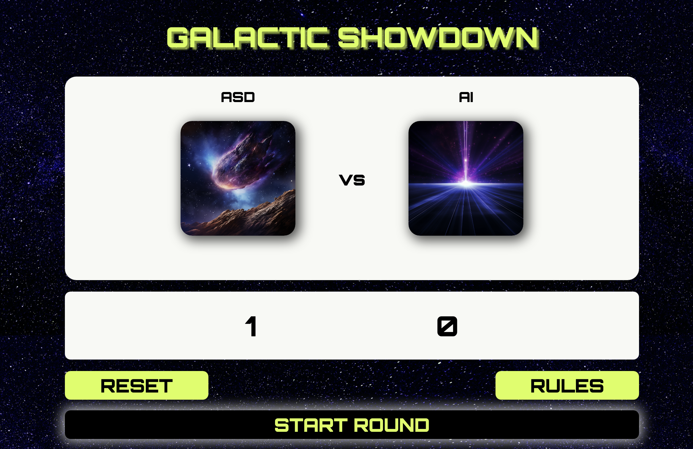
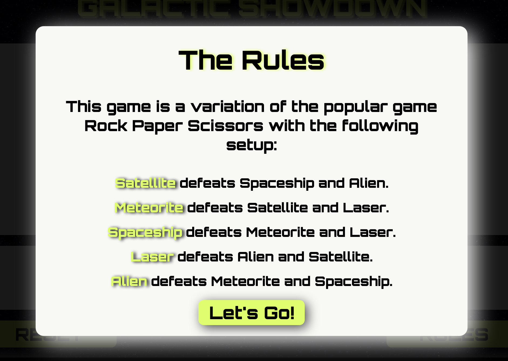
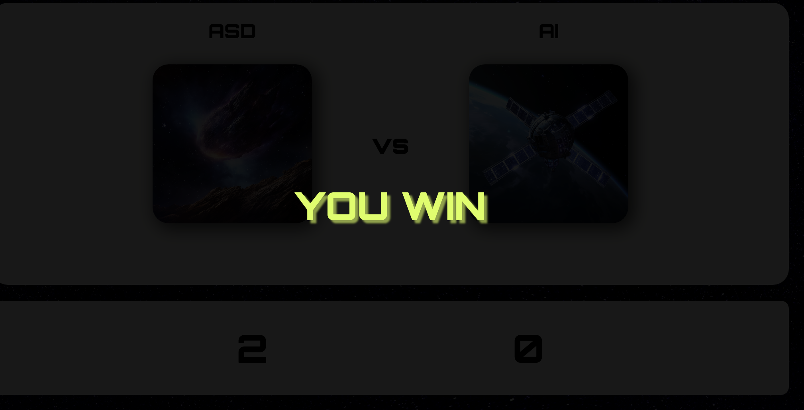
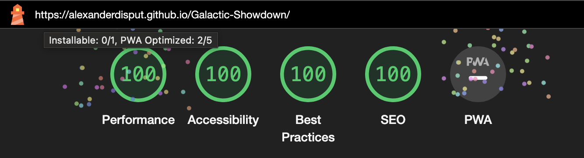

# Galactic Showdown

Welcome to the official repository of "Galactic Showdown," a thrilling space-themed variation of the classic game Rock, Paper, Scissors. Our game invites players into an interstellar battle of wits and chance, where choosing between cosmic entities like Aliens, Meteors, and Spaceships determines victory.

# Table of Contents
1. [User Experience](#user-experience)
   - [Initial Discussion](#initial-discussion)
   - [User Stories](#user-stories)
2. [Design](#design)
   - [Colour Scheme](#colour-scheme)
   - [Typography](#typography)
   - [Imagery](#imagery)
3. [Features](#features)
   - [Space-Themed Choices](#space-themed-choices)
   - [Dynamic Gameplay](#dynamic-gameplay)
   - [Intuitive User Interface](#intuitive-user-interface)
   - [Responsive Design](#responsive-design)
   - [Score Tracking](#score-tracking)
   - [Reset and Replay](#reset-and-replay)
   - [Engaging Visual Feedback and Personalisation](#engaging-visual-feedback-and-personalisation)
4. [Structure](#structure)
   - [Welcome and Personalization](#welcome-and-personalization)
   - [Game Mechanics and Display](#game-mechanics-and-display)
   - [Game Rules and Controls](#game-rules-and-controls)
   - [Gameplay Feedback](#gameplay-feedback)
5. [Accessibility](#accessibility)
6. [Technologies Used](#technologies-used)
   - [Languages Used](#languages-used)
   - [Frameworks, Libraries & Programs Used](#frameworks-libraries--programs-used)
7. [Deployment & Local Development](#deployment--local-development)
   - [Deployment](#deployment)
   - [How to Fork](#how-to-fork)
   - [How to Clone](#how-to-clone)
8. [Testing](#testing)
   - [W3C Validator](#w3c-validator)
   - [JShint](#jshint)
   - [Lighthouse](#lighthouse)
   - [Bugs I Encountered](#bugs-i-encountered)
   - [Manual Tests](#manual-tests)
9. [Credits](#credits)

# User Experience

## Initial Discussion
["Galactic Showdown" is a space-themed variation of the classic Rock, Paper, Scissors game. Set against a cosmic backdrop, it transforms the traditional game into an interstellar battle, where players choose from space-themed elements to outsmart their opponent. The game combines the simplicity of the original with engaging visuals and a unique galactic twist, making it appealing to both casual gamers and those who enjoy a sci-fi aesthetic. Designed for quick, entertaining play sessions, "Galactic Showdown" promises an exciting and visually pleasing experience.]

### User Stories
- As a new player, I want to quickly grasp how to play "Galactic Showdown" so that I can start enjoying the game immediately.

- As a casual gamer, I want the gameplay of "Galactic Showdown" to be straightforward and based on luck, offering a relaxed and fun experience without the need for complex strategies.

- As a returning player, I'm interested in easily jumping back into "Galactic Showdown" for quick and entertaining sessions, enjoying the space theme and the simple joy of chance-based victory.

## Design

### Colour Scheme
- This website uses a mix of blue and purple in contrast to the alien like green in the form of lime as accents. It is difficult to provide a clear spektrum of colours as there are many gradients of blue and purple. 

The palette was chosen through https://color.adobe.com/create/color-wheel. 

### Typography
The typography for the site is centered around the use of the "Orbitron" font family. This font has been chosen for its modern, futuristic and clear lines, which contribute to the overall aesthetic and readability of the site.

- Fallback: Sans-serif is specified as the fallback font to maintain a similar look in the event that Poppins cannot be loaded.

### Imagery
The images were carefully crafted through MidJourney to ensure that the colours as well as the asthetic is cohesive. 

Sources: 
https://www.midjourney.com/

## Features

##### Space-Themed Choices
"Galactic Showdown" reimagines the classic Rock, Paper, Scissors game with a cosmic twist. Players choose from five space-themed options: Alien, Meteor, Spaceship, Laser, and Satellite. Each symbol is represented by a visually engaging image, enhancing the interstellar gaming experience.

##### Dynamic Gameplay
At the heart of "Galactic Showdown" is the dynamic interaction between the player and an AI opponent. The game is easy to learn but offers endless fun as each round is unpredictable, driven by the chance of the players’ choices.

##### Intuitive User Interface
The game is designed with an easy-to-use interface. Upon loading, players are prompted to enter their name, which personalizes the gaming experience. The rules are displayed in a clear, concise manner, making it easy for new players to understand the gameplay.

##### Responsive Design
Designed for both desktop and mobile devices, "Galactic Showdown" ensures a seamless gaming experience across various platforms. The responsive design adapts to different screen sizes, maintaining the game's visual appeal and functionality.

##### Score Tracking
The game includes a real-time score tracking feature. Each victory against the AI is recorded, adding to the excitement of the game as players strive to outdo their previous scores.

##### Reset and Replay
Players can easily reset the score and start a new game, offering a quick replay experience. This feature is particularly enjoyable for those looking to enjoy multiple rounds in a single session.

##### Engaging Visual Feedback and personalisation
After each round, players receive visual feedback displaying the outcome - a win, loss, or draw. The game also dynamically updates the images to reflect the player's and AI's choices, substituting the placeholder images with the chosen symbols.

To personalize the gaming experience, "Galactic Showdown" prompts players to enter their name at the start of the game. This name is then displayed during gameplay, adding a personalized touch. If a player chooses not to enter a name, the game cleverly defaults to using "YOU" as the player identifier. This feature of personalization and name collection enhances player engagement and adds a unique, individualized aspect to each gaming session.

#### All Pages on the website have:

- The website features a dynamic top navigation bar that facilitates easy browsing. Adjacent to the bar on the left is the Happy Sauna Logo. On the right side of the bar, there are links to various sections of the website, including the homepage, benefits, pricing page, and a contact page. 

- On mobile devices, the traditional navigation links are replaced with a hamburger menu icon, providing a streamlined and familiar navigational experience for users. This design choice is aimed at maintaining a neat interface and ensuring a positive user experience across devices.

- A footer which contains social media icon links to Instagram and Facebook. In addition to the names, icons were used to keep the footer clean and because they are universally recognisable.

### Navigation
 For the sake of simplicity, I have entirely removed a navigation to focus exclusively on the UI and UX. This reflects the simplicity of the game itself.

We have the following navigation buttons:  
##### Reset button: 
Sets the player and computer score to 0

##### Rules button: 
Shows the rules to the player

##### Start game button: 
Starts the game logic

### Structure
The website for "Galactic Showdown" is designed as a single-page application that offers a seamless and engaging user experience. It encapsulates all the elements of the game in an intuitive layout.

##### Welcome and Personalization
- Welcome Pop-Up: Initially, users are greeted with a pop-up prompting them to enter their name for a personalized gaming experience. If no name is entered, the game defaults to "YOU".
- Player Name Display: The entered name is dynamically displayed within the game, personalizing the player's experience.

##### Game Mechanics and Display
- Game Area: This central section showcases the player's and AI's choices. Players select from five options (Alien, Meteor, Spaceship, Laser, Satellite), each represented by a visually engaging image.

- Dynamic Image Replacement: Upon selection, the player's and AI's chosen symbols are displayed using images sourced from the imageSources dictionary in the JavaScript.
- Score Area: Player and AI scores are actively tracked and updated after each round.

##### Game Rules and Controls
- Rules Display: A 'RULES' button reveals the game's rules, outlining the interactions between different choices. This content is generated and displayed dynamically.
- Interactive Controls: Players can start a new round, reset scores, or view the game rules. These controls respond to user interactions and modify the game state accordingly.

##### Gameplay Feedback
- Result Display: After each round, a message ("YOU WIN", "YOU LOSE", "IT'S A DRAW") is displayed, providing immediate feedback on the round's outcome.
- Score Updates: The scores for both the player and the AI are updated in real-time, reflecting the current status of the game.

##### Additional Functionalities
- Reset Feature: Players can reset the scores to zero at any time, enabling a fresh start.
- Responsive Layout: The website's design is responsive, ensuring a seamless experience across various devices and screen sizes.

## Accessibility
Throughout the development process, I have added accessibility functionality to make the website user-friendly for individuals with disabilities. This has been accomplished through the following measures:

- Implementing semantic HTML to enhance the site structure and context for assistive technologies.
- Adding meaningful alt attributes to images, ensuring content is conveyed even when the images cannot be seen.
- Selecting color schemes that provide ample contrast, catering to users with visual impairments.

## Technologies Used

### Languages Used
- HTML5
- CSS3
- JS

### Frameworks, Libraries & Programs Used
- Github - To save and store the files for the website.
- Google Fonts - To import the fonts used on the website.
- Google Dev Tools - To troubleshoot and test features, solve issues with responsiveness and styling.
- https://convertio.co/ to convert my images to webp
- https://www.midjourney.com/ to generate images

## Deployment & Local Development

#### Deployment
Github Pages was used to deploy the live website. The instructions to achieve this are below:

- Log in (or sign up) to Github.
- Find the repository for this project, AlexanderDisput/Project-1-Sauna.
- Click on the Settings link.
- Click on the Pages link in the left hand side navigation bar.
- In the Source section, choose main from the drop down select branch menu. Select Root from the drop down select folder menu.
- Click Save. Your live Github Pages site is now deployed at the URL shown.

### Local Development

#### How to Fork
How to Fork
To fork the Project-1-Sauna repository:

- Log in (or sign up) to Github.
- Go to the repository for this project, AlexanderDisput/Project-1-Sauna.
- Click the Fork button in the top right corner.

#### How to Clone
To clone the Bully-Book-Club repository:

- Log in (or sign up) to GitHub.
- Go to the repository for this project, AlexanderDisput/Project-1-Sauna.
- Click on the code button, select whether you would like to clone with HTTPS, SSH or GitHub CLI and copy the link shown.
- Open the terminal in your code editor and change the current working directory to the location you want to use for the cloned directory.
- Type 'git clone' into the terminal and then paste the link you copied in step 3. Press enter.

## Testing 

#### W3C Validator
The W3C validator was used to validate the HTML on all pages of the website. It was also used to validate CSS in the style.css file.

Index Page HTML
style.css CSS

#### JShint
The validator was used to validate the JS file.

#### Lighthouse
I used Lighthouse to allow me to test the performance, accessibility, best practices and SEO of the website.

The result can be seen here: 

### Bugs I encountered

##### Handling Empty Player Name Input:
Initially, when players did not enter a name in the provided input field at the start of the game, the player's name area in the game's main interface remained blank.

- Resolution Approach:
To resolve this issue, an if statement was added to check for an empty string in the player name input. If no name is entered by the player, the game defaults to using "YOU" as a placeholder. This approach ensures that there is always a clear identifier for the player in the game interface, maintaining clarity and enhancing the user experience.

##### Persistent Overlay in showMessage Function:
Originally, when this function was called to display game results (win, lose, or draw), the overlay created for the message would persist on the screen. This meant that after a message was shown, the overlay did not disappear as intended, obstructing the game's main interface and hindering further interaction.

- Resolution Approach:
To fix this issue, a setTimeout function was implemented within showMessage. This addition ensured that the overlay would automatically disappear after a set time, allowing the game to continue smoothly. 

##### Incorrect Index Range in computerChoice Function:
The function was initially using Math.random() to generate a random index for selecting the computer's choice from the array. However, it was mistakenly set to generate numbers up to 6 (Math.floor(Math.random() * 6)), leading to occasional invalid selections. Since the array contains only five elements (indexed from 0 to 4), this sometimes resulted in an undefined choice, as the index 5 does not exist in the array.

- Resolution Approach:
The solution involved adjusting the random index generation to the correct range. The code was modified to Math.floor(Math.random() * 5), ensuring that the generated index would always be within the bounds of the array (0 to 4). The revised function looked like this:

##### Typo in rulebook Dictionary
The key for 'Meteor' was mistakenly typed as 'Meteorite'. This typo caused a discrepancy in string comparisons across various functions that relied on the rulebook for game logic, as the expected key did not match the actual gameplay elements.

- Resolution Approach:
The resolution to this bug was straightforward yet crucial: correcting the typo in the rulebook dictionary. The key 'Meteorite' was changed to 'Meteor', aligning it with the rest of the game's logic. This simple fix ensured that all string comparisons involving 'Meteor' functioned as intended.

### Manual tests

| Feature | Expected Outcome | Testing Performed | Result | Pass/Fail |
| --- | --- | --- | --- | --- |
| The input field for the name | Accepts any chosen input | Entered any input | Name is added to the homepage| Pass |
| The button in the rules overlay | Closes the rules overlay and opens the player choice overaly | Clicked button| rules page closes and the choices of images for the player is opened | Pass |
| Each individual image on the Player Choice overlay | Links the user back to the main page and saves the image choice to the player image  | Clicked image | Choice overlay disappears and image is shown underneath the player's name | Pass |
| visual queue to show the player the outcome of the choice made | Click on image after a new round has started | Clicked image| Result of the game is shown as overlay for 3 seconds | Pass |
| Reset  button | Sets the score back to 0 for both players | Clicked reset button | scores are set to 0 for both players | Pass |
| Rules button | Shows the player the rules again | Clicked button | Rules overlay is shown | Pass |
| Start round button | starts a new round and shows the player the image choices | Clicked button | choice overlay is shown | Pass |

#### Code used
Blur-Cover ID: https://dev.to/konstantinstanmeyer/creating-pop-ups-11om